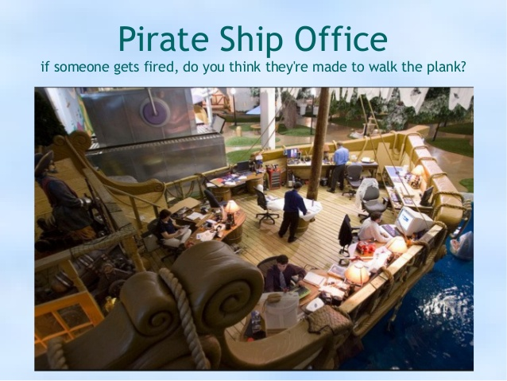

Česká pirátská strana  
krajské sdružení Praha  
krasjké sdružení Středočeský kraj  
republikové předsednictvo

Výběrové řízení na prostory pro sídlo strany - Pirátské centrum
========================

Ahoj!

Po nějakém čase jsme se rozhodli vyměnit **sídlo strany** za prostory lépe odpovídajcí našim představám a potřebám rozrůstající se strany. Hledáme tedy **nové kancelářské prostory o výměře aspoň 50 m2**, kde bychom mohli spřádat plány na parlamentní volby. Ideálně někde v širším centru, kde “budeme vidět”. 

## Využití prostor:
* Sídlo České Pirátské strany
* Sídlo a zázemí Středočeského a Pražského sdružení
* Kanceláře pirátského mediálního odboru
* Prostor pro setkávání Pirátů a společnou práci a plánování
* Uskladnění materiálů strany 
* Jednání s potencionálními partnery etc.
* Předpokládáme každodenní využití 

## Nabízíme:
* Korektní a zodpovědný přístup jak sousedům, tak k prostorům a platbě za ně
* Možnost podopřit dynamicky se rozvýjející politickou stranu se zajímavým programem zaměřeným na otevírání státu občanům
* Možnost potkávat zajímavé, netuctové lidi a být ve středu dění :-)

## Požadujeme:
* Výměra administrativních prostor 50-90 m2 (vyšší výměra se nezapočítává do výpočtu ceny za m2) 
* Maximální cena měsíčně celkem: 22 000 Kč měsíčně
* Maximální cena*) za m2 adm. plochy celkem: 300 Kč / m2
* Doprava MHD kolem 8:00 ráno z kanceláře klubu Pirátů v ZHMP (dále jen dojížděcí vzdálenost z Magoše) do 30 min
* Způsobilost pro administrativní prostory - potřeba drobných údržbových prací souvisejích s nastěhováním není na závadu
* Zdravotní nezávadnost
* Kuchyňský kout nebo místo na jeho umístění a záchod - mohou být i společné mimo prostor
* Možnost umístění skříní republikového předsednictva, Pražského a Středočeského sdružení, projektoru a dalšího nutného vybavení
* Možnost kvalitního připojení na Internet
* Možnost pronájmu zasedačky v blízkosti do 5 min pěšky (nebo součástí)
* Parkování v blízkosti do 10 min pěší chůze (aspoň placená zóna)
* Fixace/záruka ceny po nějakou dobu
* Skladové prostory v blízkosti výhodou

## Zasílání nabídek
V nabídce nám prosím zašlete v jednom PDF dokumentu popis a foto prostor tak aby je šlo hodnotit dle následujících kritérií:

   Kritérium | počet bodů | poznámka
   --------- | --------- | ------:
   Vzdálenost od nejbližší stanice Metro | 20 | za každých 30m bod dolů
   Tramvaj | 10 | za každých 30m bod dolů
   Bus | 5 | za každých 30m bod dolů
   Dojížděcí vzdálenost z MHMP | 10 | za každé 3 min 1 bod dolů
   Skladové prostory v pěší dostupnosti do 5 min za rozumnou cenu | 10 | -
   Parkování v blízkosti | 5 | -1 bod za 1 min pěší vzdálenosti
   Možnost zajet autem nakládat/vykládat do prostoru/skladu | 10 | -
   Škálovatelnost (možnost měnit pronajatou plochu na stejné adrese, přepážky - více místností) | 15 | -
   Sucho, teplo, vnitřní komfort, reprezentativnost, okna, pracovní podmínky | 30 |(30 b jsou A kanceláře, 15 B kanceláře, 0 C kanceláře) 
   Možnost dělat schůze/kapacita zasedačky (35 lidí)| 20 | -
   Vrátnice | 5 | (24/7 je max)
   Frekventované místo se zásahem na kolemjdoucí (zahrnuje možnost viditelné vnější reklamy) | 10 | (počet osob shlédnuvší reklamu, max. je cca Staromák, min. někde, kde nikdo nechodí)
   Soužití s okolím  | 10 | (zahrnuje možnost být hlučnější, třeba při promítání uměleckých děl, možnost si zahulit, spolupráci s dalšími nájemníky)
   Cena za m2 administrativních prostor ( /využitelná administrativní plocha) | 50 | (Cena = celková cena pronájmu prostoru + příslušenství, záchod apod.)
   Vysvětlit neznalému, kde to je | 5b | dobrá a srozumitelná adresa, všeobecné známé orientační body

Nabídku nám prosím zašlete do 13. března 2017, adresu michal.jokes@pirati.cz, kopii potom na info@pirati.cz, do tří dnů se Vám ozveme ohledně výsledku výběrového řízení nebo dalšího postupu.

S pozdravem  
Michal Jokeš  
Krajský koordinátor v Praze  
michal.jokes@pirati.cz, tel. 

