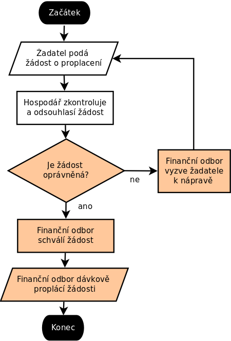

Příloha:

# Proces schvalování výdajů

**Vstupy:**
 * Požadavek člena na proplacení výdaje, který již sám uhradil, nebo
 * Požadavek na proplacení faktury či jiného výdaje.

**Kroky procesu:**
* Podání žádosti o proplacení (z některé položky1 schváleného rozpočtu2 a zároveň z některého schváleného záměru3 - zakázky) vč. dokladu
* Souhlas hospodáře příslušného hospodařit s daným záměrem
* Kontrola náležitostí žádosti finančním odborem (vč. příp. řešení neshod)
* Proplacení finančním odborem z bankovního účtu (vč. příp. pozdějšího dodání dokladu)

**Výstup:** Proplacená a zaúčtovaná transakce, o které byly zveřejněny účetní informace na webu.

1:[příklad položky](https://wiki.pirati.cz/fo/hospodareni2017/rozpocty/strana/212500110) Položka má hospodáře který schvaluje záměry z položky. Výdaje s položky nesmí překlročit limit položky.

2:[příklad rozpočtu](https://wiki.pirati.cz/fo/hospodareni2017/rozpocty/strana/start) Rozpočet se skládá z položek. Rozpočtů je 15 - jeden pro každý kraj a jeden pro centrálu strany. Viz [rozpočtová pravidla](https://wiki.pirati.cz/rules/ropr).

3:[příklad záměru](https://wiki.pirati.cz/fo/zamery/foz_1_2017) Záměry mají svého hospodáře který schvaluje výdaje ze záměru. Výdaje nesmějí překročit limit záměru. Záměry se váří ke kenkrétní organizační složce - kraji nebo centrále. Viz [pravidla hospodaření](https://wiki.pirati.cz/rules/prah).
